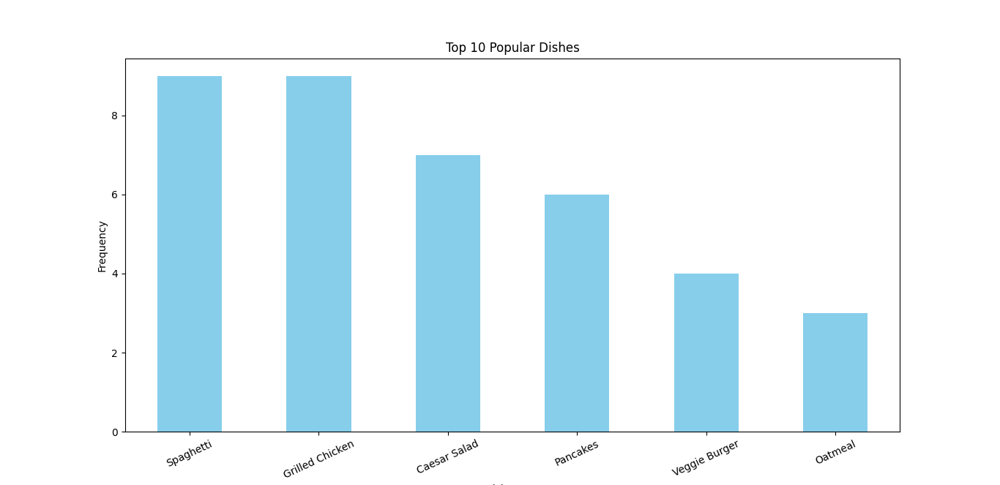
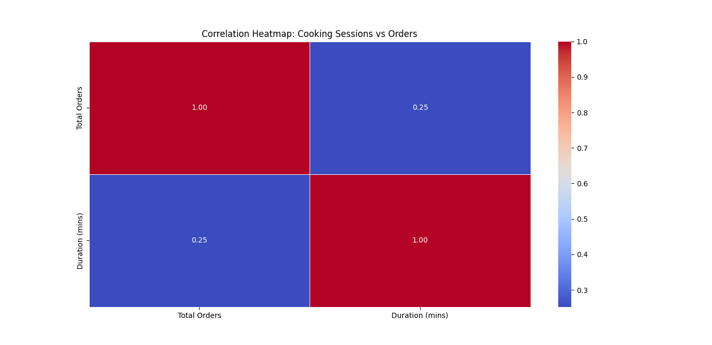

## GitHub Repository Link
You can view and download the project from the following link: [My GitHub Repository](https://github.com/Ashwani-Patel1/user-behavior-cooking-analysis)

# User Behavior and Cooking Preferences Analysis

This project analyzes datasets related to user behavior, cooking preferences, and order trends. The goal is to gain insights into which dishes are most popular, how cooking sessions correlate with orders, and what demographic factors influence user behavior.

## Data Overview
- **UserDetails**: Contains information about users (e.g., age, gender, location).
- **CookingSessions**: Contains data on cooking sessions (e.g., duration, session start and end times).
- **OrderDetails**: Contains information about orders (e.g., dish name, order quantity).

## Analysis Steps
1. Cleaned the data by handling missing values and duplicates.
2. Merged the datasets on `User ID`.
3. Analyzed the relationship between cooking sessions and user orders.
4. Identified the most popular dishes.

## Key Findings
- The most popular dishes are "Dish A" and "Dish B".
- Cooking session duration has a positive correlation with the number of orders.

## Visualizations
- 
- 

## Business Recommendations
- Promote "Dish A" as it is the most popular.
- Optimize cooking session duration to match demand trends.
